<!-- ABOUT THE PROJECT -->
# ebebek Java & QA & SAP Spartacus Practicum

## Problem Statement

Patika team decided to open a virtual store where electronic goods are sold and adds that this store makes the product management system from the trail volunteers.

The name of the Virtual Store will be "PatikaStore".
Brands will be created in the store and products will be matched with these brands.
id : The unique number of the brand registered in the system
name : Name of the brand


- When listing brands, they should always be listed in alphabetical order.
- Brands should be added statically from within the code blocks in the following order.
- Brands: Samsung, Lenovo, Apple, Huawei, Casper, Asus, HP, Xiaomi, Monster
- Currently, 2 types of product groups are planned to be sold in the store: Mobile Phones, Notebooks.
  - Later, different product groups should be added.

Features of Mobile Phone products:
- The unique number of the product registered in the system
- Unit price
- Discount rate
- The amount of stock
- Name of the product
- Brand information (Brands added in the system will be used)
- Phone memory information (128GB, 64GB)
- Screen Size (6.1 Inc)
- Battery Power (4000)
- RAM (6MB)
- Color (Black, Red, Blue)

Features of notebook products:
- The unique number of the product registered in the system
- Unit price
- Discount rate
- The amount of stock
- Name of the product
- Brand information (Brands added in the system will be used)
- Ram (8GB)
- Storage (512 SSDs)
- Screen Size (14 inches)


Some methods that system will be responsible for:
- The user should be able to list the products in the relevant category (Notebooks, Mobile Phones, etc.) through the system.
- Products should be displayed on the console screen in tabular form while listing (System.out.format() can be used).
- The user should be able to add a product and select the product's group (Mobile Phone, Notebook, etc.).
- User should be able to delete products according to their unique numbers.
- The user should be able to filter and list the products according to their unique numbers and brands.

## About Repository

This repository contains Java-Case that are related to the ebebek Java & QA & SAP Spartacus Practicum.<br>
This Java-Case is given by the patika.dev.

If you have any questions, you can contact me via any social media in the contact section.

<!-- TECHNOLOGIES -->
### Content

<p>

</p>

## Installation

- You should clone this repository to your local.
```
git clone https://github.com/mehmet-akif-tanisik/ebebekJavaPracticum-Java-Case.git
```
- You can build this project in your favorite IDE.
- This project works on console, so you can simply run this project.
```
run App.java
```

## Project Package Structure

<p>
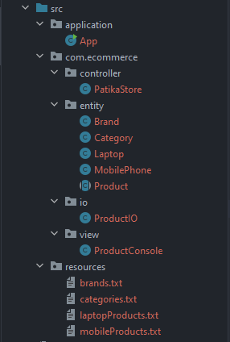
</p>

## Project Outputs
### Adding Product to the Store
<p>
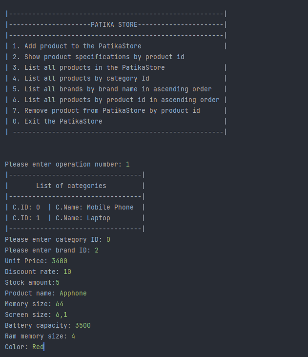
</p>

### Show Product Specifications

<p>
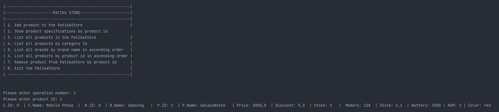
</p>

### List All Products in the Store

<p>
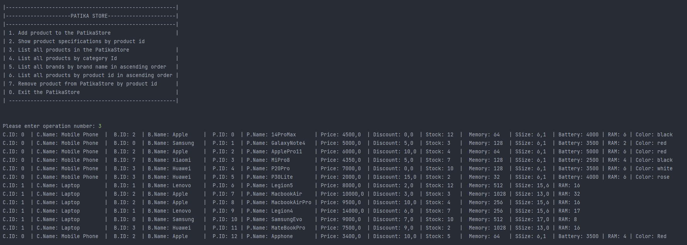
</p>

### List All Products by Category Id=0

<p>
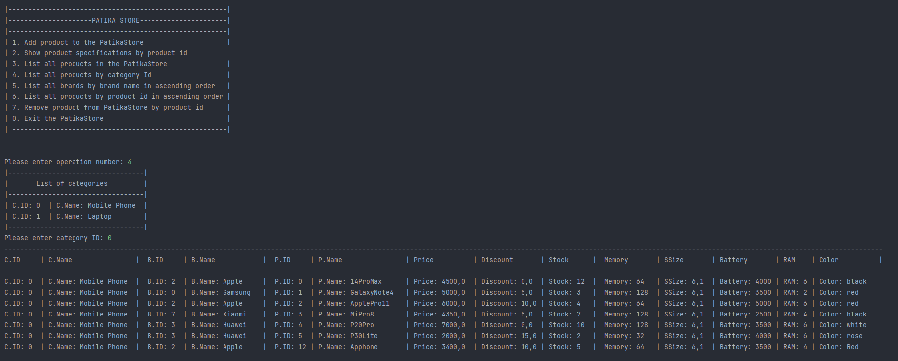
</p>

### List All Products by Category Id=1

<p>
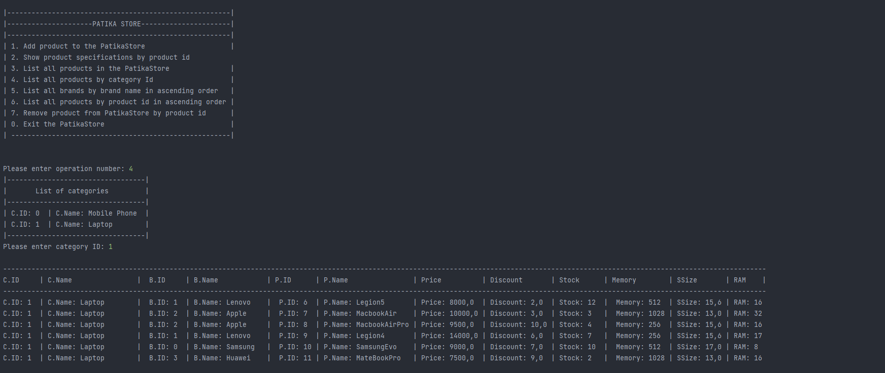
</p>

### List All Brands by Brand Name in ascending order

<p>
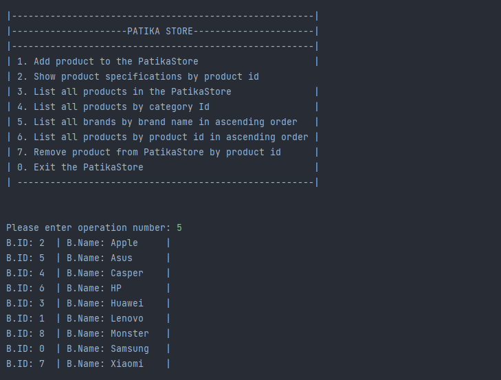
</p>


### List All Products by Product Id in ascending order

<p>
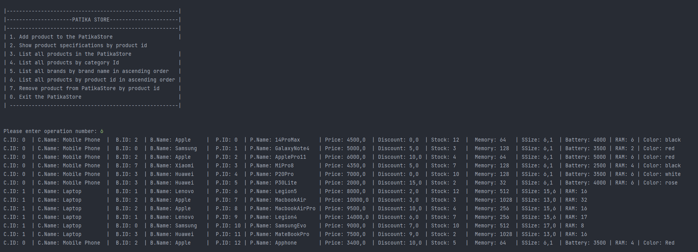
</p>

### Remove Product by Product Id from Store

<p>
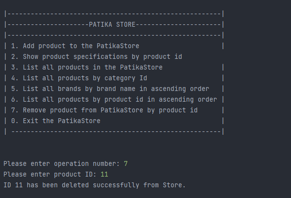
</p>

### See below: Item has been deleted from List

<p>
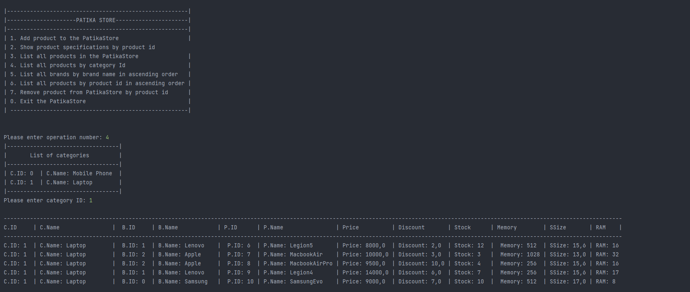
</p>


### Exit Program

<p>
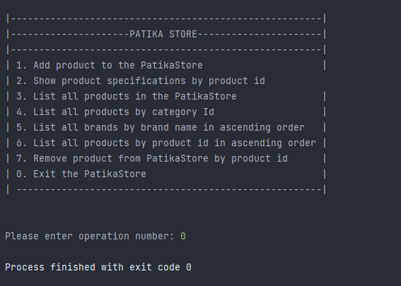
</p>


<!-- LICENSE -->
## License


Distributed under the MIT License. See `LICENSE.txt` for more information.


<!-- CONTACT -->
## Contact

### Mehmet Akif Tanisik

<a href="https://github.com/mehmet-akif-tanisik" target="_blank">

</a>
<a href = "mailto:matnsk@outlook.com?subject = Feedback&body = Message">

</a>
<a href="https://linkedin.com/in/mehmet-akif-tanisik" target="_blank">

</a>  
<a href="https://twitter.com/makiftanisik" target="_blank">

</a>

<!-- PROJECT-BOOTCAMP-PRACTICUM PART -->
<br />

## ebebek & Patika.dev
<div align="center">
  <a href="https://www.e-bebek.com">
    
  </a>

<h3 align="center">Company: ebebek</h3>
</div>
<br>
<br><br>
<div align="center">
  <a href="https://www.patika.dev/tr">
    
  </a>
<h3 align="center">Organizer: Patika.dev</h3>
</div>

